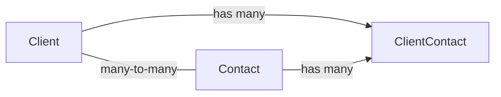
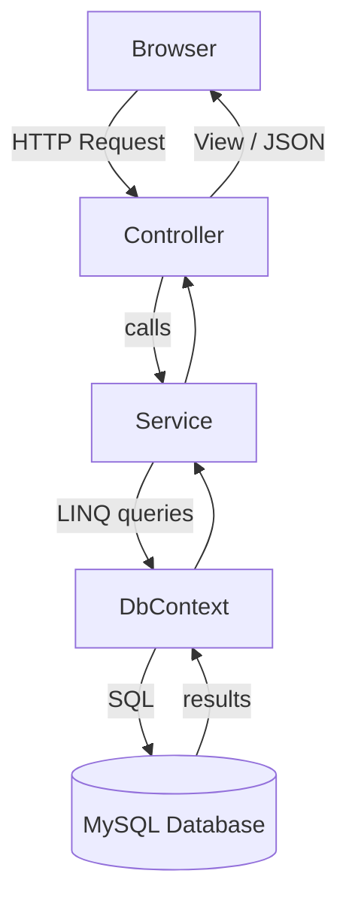
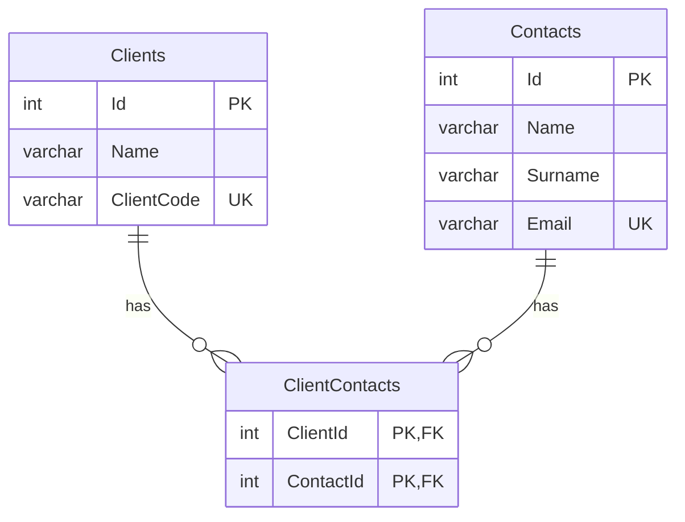
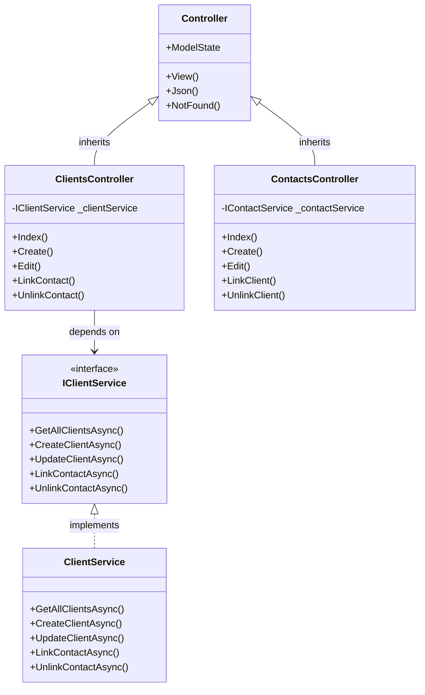
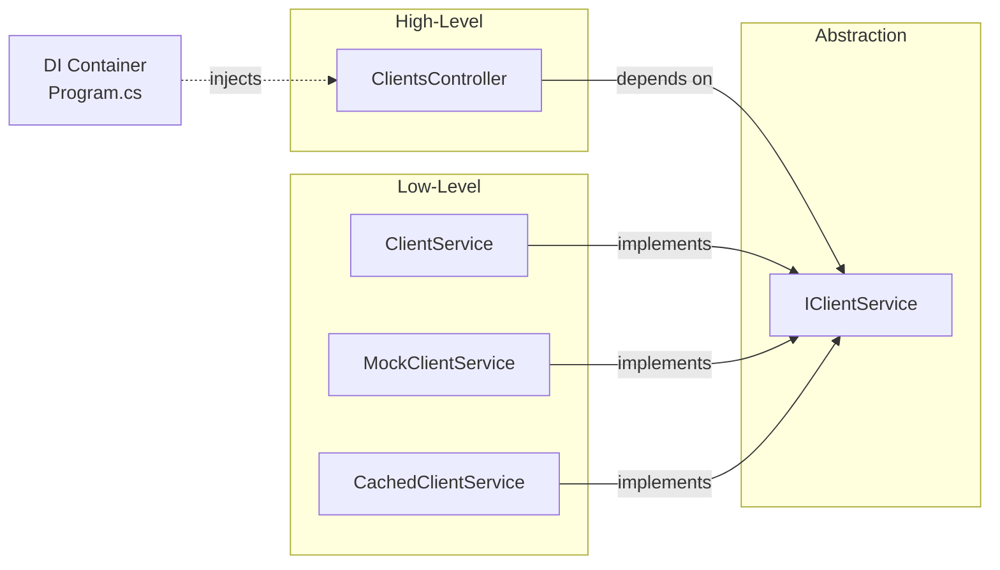
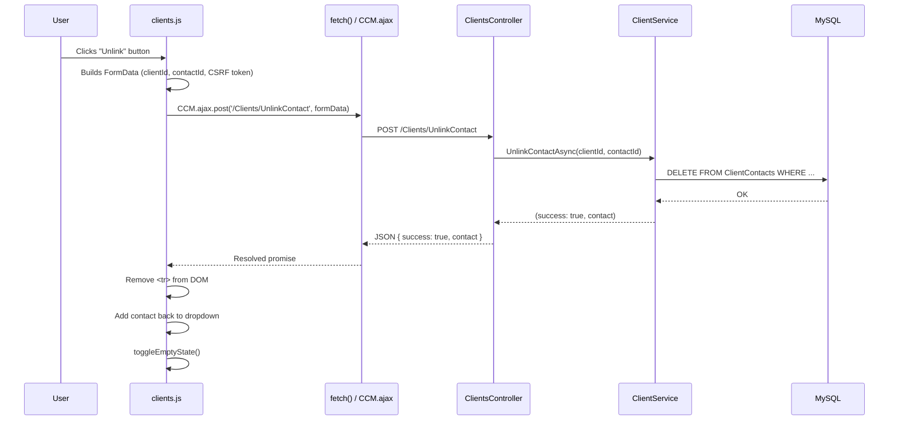
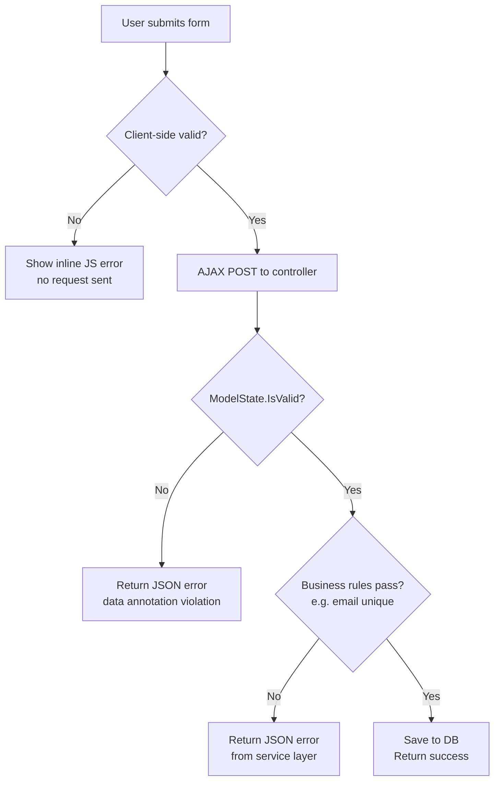

# Client Contact Manager — Project Explanation

## Project Overview

I built Client Contact Manager as a web application that allows a business to manage its clients and their associated contacts. The core idea is a many-to-many relationship — a single client can have multiple contacts, and a single contact can be linked to multiple clients.

The app lets users create and edit clients and contacts, and link or unlink them from each other without any page reloads, using AJAX. I built it using C# with ASP.NET Core MVC on the backend, Entity Framework Core as my ORM, MySQL as the database, and vanilla JavaScript with Bootstrap 5 on the frontend.

---

## Architecture — MVC + Service Layer

I structured the app using the MVC pattern, but I added a dedicated service layer between the controllers and the database.

Controllers handle incoming HTTP requests, check whether the submitted data is valid, and return either a Razor view or a JSON response. Importantly, they contain no business logic at all. All of that lives in the service layer, which is where rules like email uniqueness and link management are enforced. The services interact with the database through EF Core via an injected `AppDbContext`.

I kept the views simple — they're Razor `.cshtml` templates that receive ViewModels, not raw entity objects. I used ViewModels specifically to control exactly what data each view gets, keeping the entity models clean and avoiding over-exposure of database structure to the frontend.

The reason I chose this separation is that it gives each class a single, clear responsibility. The controller changes only if HTTP behaviour changes; the service changes only if business rules change. It also means I could test the service layer independently without spinning up a web server.

---

## Database & Relationships

My database has three tables: **Clients**, **Contacts**, and **ClientContacts**.

Clients stores the client's name and a unique client code. Contacts stores a person's name, surname, and email address, where the email has a unique index enforced at the database level. ClientContacts is a junction table that implements the many-to-many relationship between the two — it holds a `ClientId` and a `ContactId` as a composite primary key, both of which are foreign keys with cascade delete configured.

I chose a junction table because a many-to-many relationship can't be represented any other way in a relational database — you can't store multiple foreign keys in a single column. The cascade delete means that if a client or contact is deleted, all their associated link records are automatically cleaned up.

I configured all of this — the relationships, indexes, and cascade behaviour — in `AppDbContext.OnModelCreating` using EF Core's Fluent API.

---

## OOP Principles

**Encapsulation** is demonstrated in my `Client` model. The `ClientCode` property uses C#'s `init` accessor, meaning it can only be set at the time the object is created and cannot be mutated afterwards. I also typed the navigation collection as `ICollection<T>` rather than `List<T>`, hiding the concrete implementation. Database state is never exposed raw — it's always projected into a ViewModel before reaching a view.

**Abstraction** is visible in my service interfaces like `IClientService`. The controller only knows what operations are available — `GetAllClientsAsync`, `CreateClientAsync`, `LinkContactAsync`, and so on — but has no knowledge of how they work. EF Core and MySQL are completely hidden behind that interface.

**Inheritance** is used by my controllers, which both inherit from ASP.NET Core's built-in `Controller` base class. This gives them access to `View()`, `Json()`, `NotFound()`, `ModelState`, `HttpContext`, and more, without me having to implement any of it myself.

**Polymorphism** is applied through dependency injection. My controllers hold a reference typed as `IClientService`. At runtime, the DI container injects the concrete `ClientService` instance. If I wanted to swap in a mock for testing or a caching implementation, I'd only need to change one line in `Program.cs` — the controller itself would be completely unaffected.

---

## SOLID Principles

**Single Responsibility:** `ClientsController` only handles routing and HTTP responses. `ClientService` only handles business logic. Each class has exactly one reason to change.

**Open/Closed:** My service interfaces act as a stable contract. If I wanted to add a caching layer or an audit-logging service, I'd create a new class implementing the interface — I wouldn't need to touch the controller or any existing code.

**Liskov Substitution:** `ClientService` correctly implements every method declared in `IClientService`. No method throws `NotImplementedException`, no contracts are broken. Any code working with the interface can receive a `ClientService` instance and it will behave as expected.

**Interface Segregation:** I kept `IClientService` and `IContactService` as separate interfaces, each focused on its own entity. Neither interface contains methods that don't belong to it, so neither forces its implementor to provide irrelevant behaviour.

**Dependency Inversion:** My controllers never call `new ClientService()`. They declare their dependency as a constructor parameter typed to the interface, and the DI container in `Program.cs` provides the concrete implementation. High-level policy is fully decoupled from low-level detail.

---

## AJAX

I implemented all link and unlink actions using AJAX so the page never reloads during those interactions. Here's what happens when a user clicks Unlink on a contact:

1. `clients.js` intercepts the click via event delegation on the contacts table body.
2. It builds a `FormData` object containing the `clientId`, `contactId`, and the CSRF anti-forgery token.
3. It calls my shared `CCM.ajax.post()` helper, which uses the browser's `fetch()` API to send a POST request in the background.
4. `ClientsController.UnlinkContact` receives the request, calls `_clientService.UnlinkContactAsync()`, and returns a JSON object with a `success` flag.
5. Back in the JavaScript, if `success` is true, the table row is removed from the DOM and the contact is added back to the available dropdown. If it fails, an error alert is shown.

I included the CSRF token in every POST request to protect against cross-site request forgery. I also made sure every AJAX call has a `catch` block, so a network failure always shows a visible error — the UI never silently fails.

---

## Validation

I handle validation on two levels intentionally, because each serves a different purpose.

**Client-side validation** in `validation.js` and the form-specific JS modules provides immediate feedback as the user types — required field checks, email format checks, and Bootstrap validity styling. This is purely for user experience.

**Server-side validation** runs regardless of what the browser does. The controller checks `ModelState.IsValid` first, catching any data annotation violations like `[Required]`, `[MaxLength]`, and `[EmailAddress]`. Then the service layer performs business-rule checks — for example, querying the database to confirm an email address isn't already in use before allowing a contact to be created. This can't be bypassed by the client.

The reason I have both is that client-side validation is for convenience, but server-side validation is for correctness and security. You can never trust input from the browser alone.

